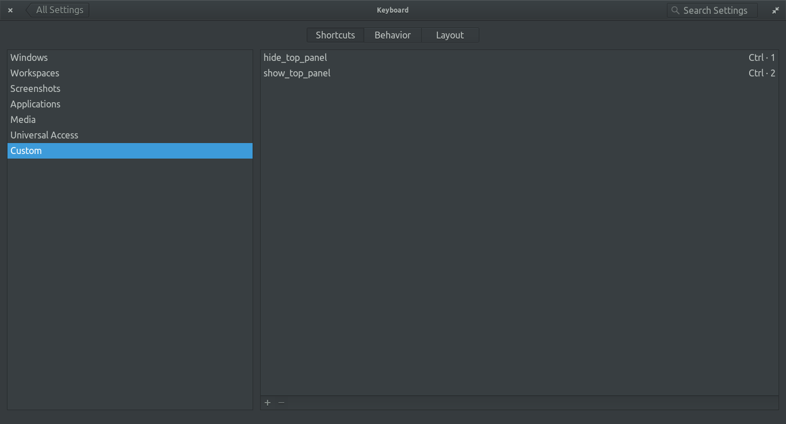

# Hide wingpanel
Hi, Here is a so (rly) simple script to manage **hide** and **show** **wingpanel**.  
**wingpanel** is the top panel in elementary os.  
It tested on **elementary os 0.4**. 2017.

I just noticed that some users want to **hide** the **wingpanel** (including myself), and there is no option available to do this.  
so i just did this with simple **killall** and **start**.

## Table of Contents
+ [Install](#Install)
+ [Usage](#usage)
	+ By keyboard shortcut (recommended)
	+ By command
+ [License](#license)
+ [Donate](#donate-bitcoin)

---
### Install
+ `git clone https://github.com/mlibre/hide-wingpanel.git`
+ `cd hide-wingpanel`
+ `sudo ./show_hide_top_panel.bash`

done!

---
### Usage
+ <big>**By keyboard shortcut**</big>
	+ Define keyboard shortcut like this:
	
	

+ <big>**By command**</big>
	+ Run `hide_top_panel` in terminal to hide the panel.
	+ Run `show_top_panel` in terminal to show the panel.

---
### License
This project mainly has no license! You may consider this as **Public Domain**, **CC0** or **unlicense**. But I use some material that has **their own licenses**, you can see the **license file** for more details.

---
### Donate Bitcoin
My **Bitcoin Wallet** Address: `1AHL9xkqMwVmp5uZoMy4PbRHJ4wMX1pqdy`

---
